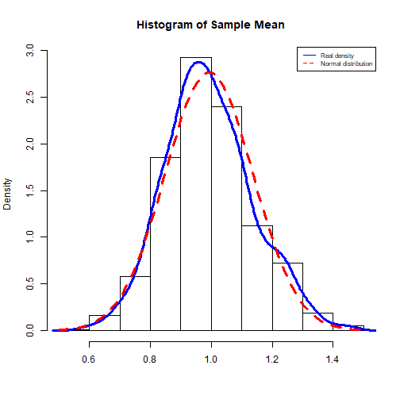

Course Project Presentation
========================================================
author: HPSUN
date: 2017-12-4
autosize: true

Object of This Project
========================================================


- Learn how to deploy a shiny app
- Built a Data project on using shiny


My Idea of the Project
========================================================

I'd like to show the simulation experiments of Central Limit Theorem.  
Which means that given a sufficiently large sample size from a population with a finite level of variance, the mean of all samples from the same population will be approximately equal to the mean of the population.

For more information:
https://en.wikipedia.org/wiki/Central_limit_theorem


Detail
========================================================

The app can generate random numbers from different distribution.  
Run several times and calculate the means of samples.  
Compare with theoretical mean and normal distribution.    
The three arguments are need to input from user:  

```r
sliderInput("n","Number for sample:",#input1: the sample size for each sample
    min = 5,max = 100,value = 50),
sliderInput("sim_t","Experiment times:",#input2: experiment times 
    min = 10,max = 5000,value = 1000),
selectInput("distri",label = "Choose a distribution",#input3: distribution tested
    choices = list("Normal", "Exponential","Poisson"),selected = "Exponential")
```


Example
========================================================
Here is an output example from Default input. You can see that the sample mean distribution is very similar to normal distribution.  



